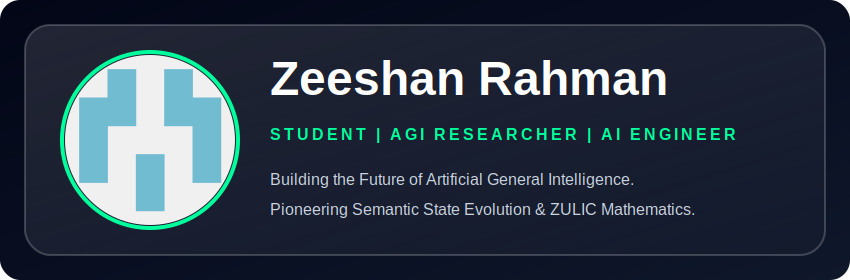
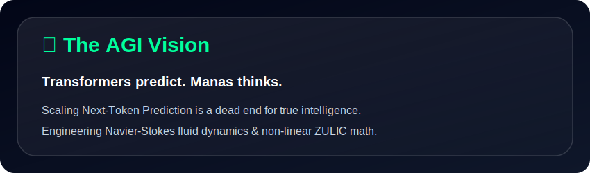

  

  

 

  
  

---

<h2>📑 Table of Contents</h2>

1. [The AGI Manifesto](#1-the-agi-manifesto-the-end-of-stochastic-parrots)
2. [The Core Philosophy: Meaning Before Language](#2-the-core-philosophy-meaning-before-language)
3. [The Mathematical Foundations](#3-the-mathematical-foundations-of-cognition)
    - [The ZULIC Operator](#the-zulic-operator-non-linear-cognitive-jumps)
    - [Cognitive Fluid Dynamics (Navier-Stokes)](#cognitive-fluid-dynamics-navier-stokes)
    - [Semantic Contrastive Loss](#semantic-contrastive-loss-objective)
4. [The Manas Architecture](#4-the-manas-architecture)
5. [Tech Stack & Cognitive Tools](#5-tech-stack--cognitive-tools)
6. [Engineering Impact & Live Stats](#6-engineering-impact--live-stats)
7. [The Path Forward (2026-2030)](#7-the-path-forward-roadmap)

---

  

## 1. The AGI Manifesto: The End of Stochastic Parrots

We stand at the precipice of a new era in computation, yet the entire industry is trapped in a local minimum. Today's most advanced Large Language Models (LLMs) are fundamentally flawed. They operate on a single, archaic principle: **Next-Token Prediction (NTP)**.

They are stochastic parrots. They do not think; they calculate conditional probabilities. They compute $P(x_{t} | x_{<t})$, guessing the most statistically likely word to follow a sequence. When they solve a math problem or write code, it is a byproduct of massive data memorization, not genuine reasoning. 

To achieve **Artificial General Intelligence (AGI)**, we cannot simply scale up parameters or add more data to a Transformer. Scaling a broken paradigm only yields a larger broken paradigm. AGI requires a system that builds a conceptual model of the world, reasons internally over that model, and only articulates when a conclusion is reached. 

**My mission is to dismantle the Transformer paradigm and replace it with a true cognitive architecture.**

---

## 2. The Core Philosophy: Meaning Before Language

Humans do not think in a linear stream of words. We think in concepts, images, abstractions, and logical states. When asked a complex question, a human pauses, processes the meaning, connects distant concepts in a high-dimensional cognitive space, and *then* translates that final resolution into language.

I am engineering **Semantic State Evolution (SSE)**.

In SSE, language is merely the interface, not the engine. The core system operates entirely in a continuous, non-linguistic vector space. The architecture is divided into three distinct phases:

1. **The Perceiver (Comprehension):** Ingests raw text and compresses it into a highly dense, language-agnostic **Semantic State Vector (SSV)**.
2. **The Cognitive Engine (System 2 Reasoning):** The core of the AGI. It takes the SSV and evolves it over continuous time. This is where logic, causal reasoning, and memory retrieval occur. The state changes dynamically until it reaches a stable energy minimum.
3. **The Articulator (Translation):** Takes the final, stabilized SSV and translates pure meaning back into human language.

---

## 3. The Mathematical Foundations of Cognition

Standard neural networks rely on static matrix multiplications and simple non-linearities (ReLU, GeLU). To model true thought, we require advanced, continuous-time mathematics.

### The ZULIC Operator: Non-Linear Cognitive Jumps
To allow the network to make intuitive leaps between distant concepts, I am exploring the implementation of the **Z-Operator**. Unlike standard gradients, the Z-Operator models sudden state transitions in cognitive space.

$$
\mathcal{Z}(f, x) = \lim_{\Delta \to 0} \frac{f(x + \Delta) - f(x)}{\Delta^{\beta}} 
$$

Where $\beta$ is a fractional derivative parameter controlling the "chaos" or creativity of the thought process. This allows the model to escape local minima in reasoning tasks that stump standard gradient-descent trained Transformers.

### Cognitive Fluid Dynamics (Navier-Stokes)
Thought is not discrete; it flows. By mapping the evolution of the Semantic State Vector $S(t)$ over cognitive time $t$, we can apply principles from fluid dynamics to smooth out irrational logic pathways.

I utilize a modified Navier-Stokes equation to govern the transition of the SSV:

$$
\frac{\partial S}{\partial t} + (S \cdot \nabla)S = -\nabla P + \nu \nabla^2 S + \mathcal{Z}(S)
$$

Here, $\nu \nabla^2 S$ acts as a "viscosity" term, ensuring the model's reasoning doesn't spiral into hallucination, while the ZULIC force $\mathcal{Z}(S)$ introduces creative problem-solving energy.

### Semantic Contrastive Loss Objective
We completely abandon Cross-Entropy Loss. Cross-entropy punishes a model for using a synonym. Instead, the model is trained using a variant of the **Joint Embedding Predictive Architecture (JEPA)**.

Let $X$ be a complex problem and $Y$ be the solution. The encoder $\mathcal{E}$ produces states.
The Cognitive Engine $\mathcal{T}$ evolves the state.

$$
\mathcal{L}_{cognitive} = || \mathcal{T}(\mathcal{E}(X), \Delta t) - \mathcal{E}(Y) ||^2_2
$$

The model is rewarded for reaching the correct *meaning* state, regardless of the words it eventually chooses to express it.

---

## 4. The Manas Architecture

[**Manas**](https://github.com/Zeeshan00090/Manas) is the flagship engine where this theory becomes reality. It is currently in active development, transitioning from a hybridized attention model to a pure Continuous-Time Cognitive Engine.

### 🧩 Core Modules

| Module | Description | Mathematical Basis |
|---|---|---|
| **GoalTree** | A dynamic hierarchical planner that breaks complex queries into sub-tasks. | Graph Theory, A* Search |
| **Semantic Codec** | Maps language tokens into continuous concept space. | Autoencoders |
| **Liquid ZULIC Core** | The reasoning engine. Evolves state over time. | Neural ODEs, Fluid Dynamics |
| **Thermal Guard** | Prevents the model from getting stuck in infinite reasoning loops (hallucination collapse). | Entropy Monitoring |
| **Nexus Orchestrator** | The connective tissue allowing the Cognitive Engine to execute code and use tools. | API / Sandbox Integration |

---

## 5. Tech Stack & Cognitive Tools

Building AGI requires mastery over both theoretical research and hardcore systems engineering.

### 🧠 Theoretical & Modeling

  
  
  
  

### ⚙️ Systems Engineering & Optimization

  
  
  
  

### ☁️ Infrastructure & Deployment

  
  
  
  

---

## 6. Engineering Impact & Live Stats

The code I write is pushed constantly. AGI requires relentless iteration.

<table align="center">
  <tr>
    <td align="center">
      
    </td>
    <td align="center">
      
    </td>
  </tr>
</table>

  

 

  

---

## 7. The Path Forward (Roadmap)

### 2026: Foundation
- [x] Prove theoretical limits of Standard Transformers.
- [x] Draft initial ZULIC operator mathematics.
- [ ] Train the first multi-modal **Semantic Autoencoder** capable of compressing logic puzzles into steady-state vectors.

### 2027: Cognitive Assembly
- [ ] Implement Liquid Time-Constant (LTC) networks inside the Manas Cognitive Core.
- [ ] Run first closed-loop reasoning tests using Fluid Dynamics loss minimization.
- [ ] Publish findings on continuous-time thought loops vs discrete token generation.

### 2028-2030: Towards General Intelligence
- [ ] Scale the Cognitive Engine on distributed GPU clusters using custom C++ bindings.
- [ ] Achieve autonomous tool use and self-correction without hallucination loops.
- [ ] Launch **Manas v1.0** — A machine that thinks before it speaks.

---

> *"The question is not whether machines can think, but whether we are bold enough to build the mathematics required to let them."* — Zeeshan Rahman
